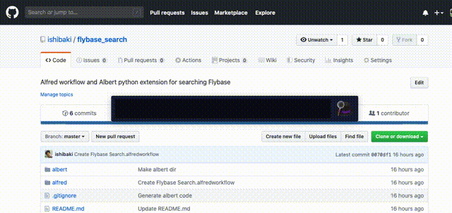

# Flybase Search

Flybase gene searcher *via* [Alfred](https://www.alfredapp.com)/[Albert](https://albertlauncher.github.io).

## Usage

1. Open Alfred/Albert and triggering by `fly `.
2. Enter the gene name (e.g. `fly N`, `fly Myo31DF`, `fly emc`, ...)
3. Push `Enter` and you can access the Flybase page.

## Install

### Alfred

1. [Download fbgn.csv](https://ecsosaka-my.sharepoint.com/:x:/g/personal/u969789f_alumni_osaka-u_ac_jp/EfKcY45yeelMusdqFGsergUBiRRjT6SWP08xipM7YWE1rA?e=n9BrWJ) in `$HOME/Documents/`.
2. Install `./alfred/Flybase Search.alfredworkflow`

### Albert

1. [Download fbgn.csv](https://ecsosaka-my.sharepoint.com/:x:/g/personal/u969789f_alumni_osaka-u_ac_jp/EfKcY45yeelMusdqFGsergUBiRRjT6SWP08xipM7YWE1rA?e=n9BrWJ) in `./albert/`.
2. Copy this directory to `$HOME/.local/share/albert/org.albert.extension.python/`
